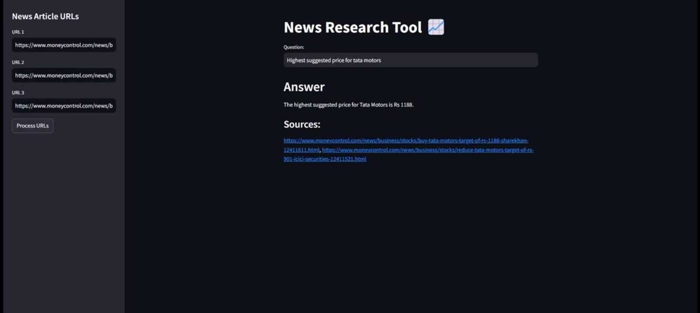

### README.md

### Stock Trend Analyzer: AI-Powered Research Assistant

This project is an AI-powered application designed to function as an equity research analysis bot. Its primary purpose is to take multiple news articles or documents and provide accurate, synthesized answers to user questions, acting as a smart, on-demand research tool.

---
## 📸 Project Screenshot

---

### Project Architecture and Importance

This project is crucial because it overcomes the limitations of traditional language models like ChatGPT when handling large volumes of specific, domain-related data. Instead of feeding an entire article to a language model, which is inefficient and costly, this application uses an advanced architecture to find only the most relevant information.

#### How It Works: The Role of the Vector Database

The project's unique architecture is built on a **vector database**, which is a specialized tool for storing and retrieving information based on its meaning, or **semantic similarity**.

1.  **Semantic Search**: When you ask a question, the application doesn't just look for keywords. It uses a semantic search model, like the ones from OpenAI or Hugging Face, to understand the *meaning* of your question.
2.  **Data Retrieval**: This semantic understanding is used to search the vector database and retrieve only the specific sections of the articles that are most relevant to your query. This process is highly efficient and precise.
3.  **Answer Generation**: The retrieved, concise information is then passed to a large language model (LLM) to generate a complete and coherent answer.

This approach ensures the answers are based on specific, verifiable sources, are not constrained by context windows, and significantly reduces the cost associated with LLM API calls.

For handling very large documents, the project uses the **Map Reduce method**. This technique breaks down a big article into smaller chunks, processes each one for a partial answer, and then combines those partial answers into a single, comprehensive final response. This allows the application to handle documents that are too large for a single LLM query.
